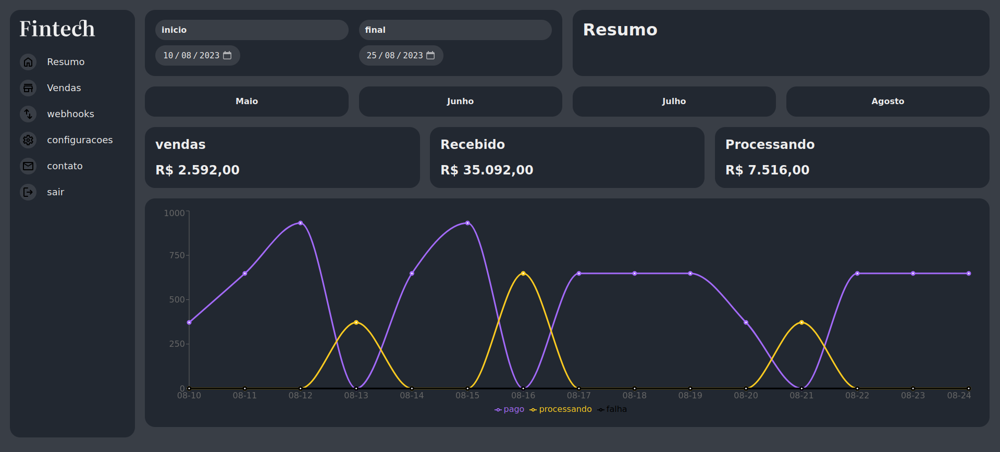

# Fintech

#### Access here -> [Fintech]('https://fintech-psi.vercel.app/')
 

# Overview

Fintech is a dashboard that serves to monitor, in real time, information on sales performance, receipts and processing over a period of one month. This period refers to the day the site is being accessed.

The application was built in the course "React with Typescript" by [Origamid]('https://www.origamid.com/'). the focus of the course was to learn how to define the type of the main hooks, such as useState, useContext, useEffect and others. As well as learning about React interfaces.

# Technologies Used

- React: JavaScript library for building user interfaces.
- Typescript: a strict syntactic superset of JavaScript and adds optional static typing to the language.
- Recharts: [Recharts]('https://recharts.org/en-US/') is a composable charting library built on React components. It makes integrating charts into our React application seamless and easy.

 

# How to Run the Project

### Environment setup:

- [Node](https://nodejs.org/en)

### in the terminal:

- Clone this repository. `git clone https://github.com/matheusleite01/Fintech.git`
- Run `npm install`
- Run `npm run dev`
- Ready 🎉

 

# Next Steps

- Improve the layout and user experience.
- Add extra features, such as extended forecast, dynamic weather icons, etc.
- Implement automated testing.
- Refactor the code to follow best practices and development standards.

Feel free to contribute with improvements, bug fixes, or suggestions. I hope this project serves as a useful learning opportunity in React!

 
